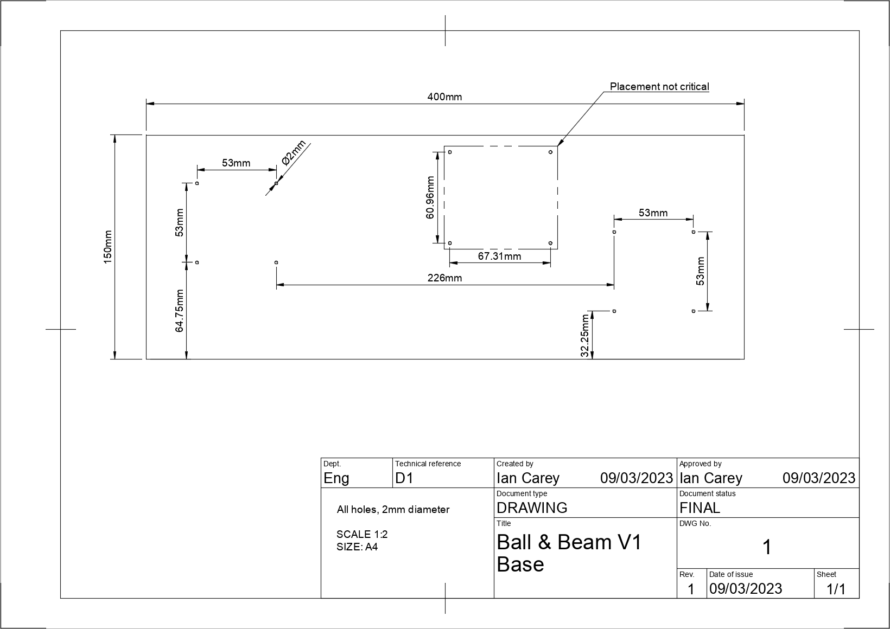

These are the detailed assembly instructions for the Ball & Beam kit with pictures! This guide assumes you have successfully 3d printed the parts and also have a suitable piece of base material to mount everything to.

### Step 1

The first step will be to prepare your base material to mount the other components to. We recommend a 12mm thick (or thicker) piece of ply wood for this task. The material isn't very important but the only real requirements are that is it flat enough and rigid enough to mount the components to. If it is slightly heavy that is also ideal as it will help reduce vibrations in the rig. The material should also be thick enough to securely accept mounting screws for the 3d printed parts. In our version, we use 10x3mm countersunk wood screws.

To prepare your piece of material, cut it to be approximately 400x150mm. Depending on your material, you might want to give the edges some light finishing with sandpaper to clean off any splinters or burrs. At this point, the base is more or less done. If you have chosen to use wood for your base, you can at this point mount your pieces approximately and screw them down. However, we recommand a couple of extra steps to result in a better finished product.

#### Step 1.a

To ensure your rig is properly aligned, we recommend pre-drilling guide holes in the base for your mounting screws. The below hole pattern is more or less the optimal layout for the rig and ensures all the joints will be aligned properly. You can also make your own hole pattern by laying out the pieces by eye and marking the hole positions. Once your holes are drilled we also recommand giving it a coat of paint if it's wood to clean up the finish a bit (we LOVE matt black!).

Finally, we recommand attaching either adhesive carpet or rubber pads to the bottom of the board. This can help even out the surface if the base piece has any warp in it and also helps reduce vibrations caused by the machine while operating.

### Step 2

