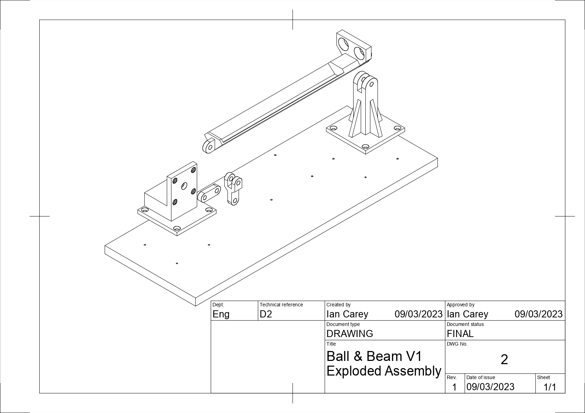
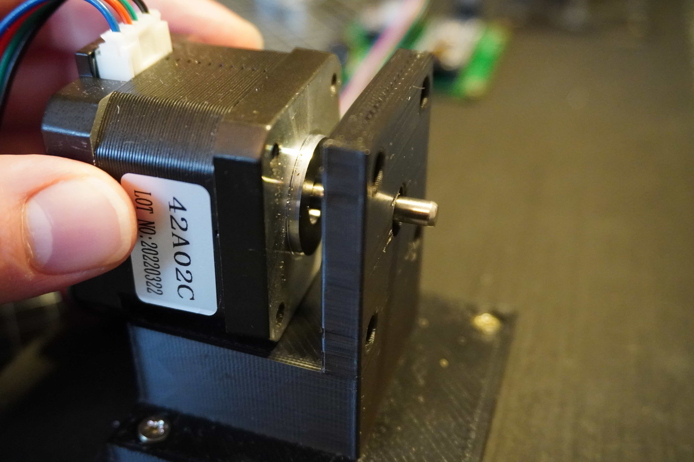
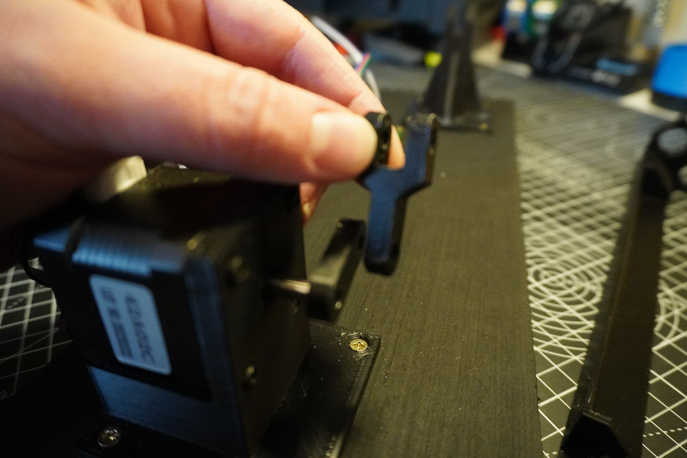
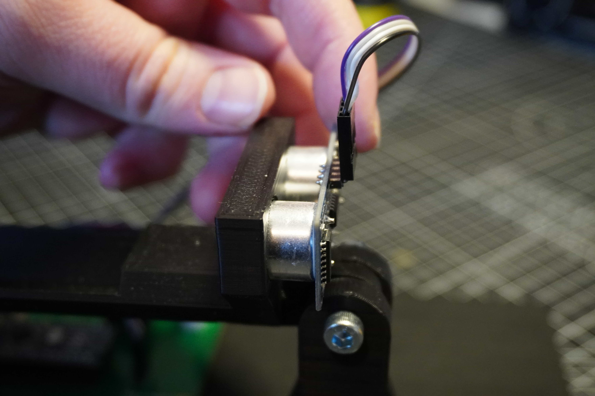

These are the detailed assembly instructions for the Ball & Beam kit with pictures! This guide assumes you have successfully 3d printed the parts and also have a suitable piece of base material to mount everything to. If you haven't 3D printed your parts yet, [here is a link to the STL files](https://github.com/careyi3/balance_beam_kit/tree/master/cad/meshes). We recommend printing in simple PLA, but any material will do fine.

Due to possible tolerance issues with 3D printing in general, the fit of the moving parts below is designed to be loose. We recommend getting a set of assorted small nylon washers to insert into the joints to help pad them out if they are too loose. Equally, we recommend having a small file on hand to make adjustments as needed.

It should also ne noted that this assembly involves a few different lengths of M5 screws. For simplicity these also act as the bearing surfaces for the moving parts. This means that they can come loose over time as the machine moves. You might need to use locking nuts and/or washers to help the parts move more freely and not come loose.

### Step 1

The first step will be to prepare your base material to mount the other components to. We recommend a 12mm thick (or thicker) piece of ply wood for this task. The material isn't very important but the only real requirements are that is it flat enough and rigid enough to mount the components to. If it is slightly heavy that is also ideal as it will help reduce vibrations in the rig. The material should also be thick enough to securely accept mounting screws for the 3d printed parts. In our version, we use 10x3mm countersunk wood screws.

To prepare your piece of material, cut it to be approximately 400x150mm. Depending on your material, you might want to give the edges some light finishing with sandpaper to clean off any splinters or burrs. At this point, the base is more or less done. If you have chosen to use wood for your base, you can at this point mount your pieces approximately and screw them down. However, we recommand a couple of extra steps to result in a better finished product.

#### Step 1.a

To ensure your rig is properly aligned, we recommend pre-drilling guide holes in the base for your mounting screws. The below hole pattern is more or less the optimal layout for the rig and ensures all the joints will be aligned properly. You can also make your own hole pattern by laying out the pieces by eye and marking the hole positions. Once your holes are drilled we also recommand giving it a coat of paint if it's wood to clean up the finish a bit (we LOVE matt black!).

Finally, we recommand attaching either adhesive carpet or rubber pads to the bottom of the board. This can help even out the surface if the base piece has any warp in it and also helps reduce vibrations caused by the machine while operating.

### Step 2

With the holes drilled, begin to mount your motor mount and fulcrum to the base piece using some 10mm countersunk M4 wood screws. Looking at the front face, mount the motor mount to the left and the fulcrum to the right as indicated in the exploded diagram above. Ensure not to over tighten the screws as the 3D printed parts can easily break if tightened too much.

If you have the PCB for the kit, mount this now using the same screws.

### Step 3

Mount the motor by inserting it into the mount from the back. There is a slight recess in the mount which the motor should form a firm press fit with.

Next, fix the motor in place with 4x10mm M3 socket head cap screws. Ensure to start each screw the tighten them incrementally so that the motor evenly pulls into the slot on the mount. Make sure not to over tighten as this might deform and/or break the mount.

### Step 4

Take the lower arm piece and holding it up to the motor shaft, align the flat spot on the mounting hole with the flat slot on the motor shaft.

Once lined up, press the arm onto the motor shaft. It should be a tight press fit. If it's too tight, you may need to deburr your parts or use a small file to widen the hole.

### Step 5

Once the lower arm is attached, take the upper arm and line it up with the other hole in the upper arm. Ensuring the open end of the clevis (U-shaped part) is facing upwards.

Secure the lower and upper arms using an 20mm M5 bolt and nut.

### Step 6

Insert the end of the beam with the sensor mounting point closest to the fulcrum. Lining up the hole in the beam with the cross-hole in the fulcrum's clevis, insert a 25mm M5 bolt and secure with a nut.

On the far end of the beam, insert the tab into the clevis on the upper arm piece and secure with an 20mm M5 bolt and nut.

### Step 7

Insert the sensor into the mounting point on the beam. The sensor should form a smooth slip fit into the holes on the beam. If not, you may need to remove some material from the holes to allow the sensor to fit.

Pressing the sensor gently, it should push right into the mounting holes to it's final depth as shown. Note, the orientation should be such that the connector it facing upwards to allow clearance for the wires.

### Step 8

With the mechanical assembly now finished, the next steps are to wire everything, upload the code and turn it on! To learn more about these steps, head over to the [Electronics](../electronics) and [Programming](../programming) sections!
