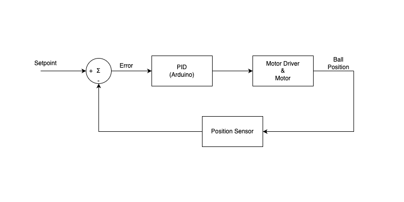

## Introduction

The main goal of the project is to act as a resource for teaching the basics of control theory and in particular the practical implementation of a PID controller. Below is a system diagram showing the main components of the system and their connection in the common system diagram format.

** Explain system diagram here **

## How does a PID controller work?
