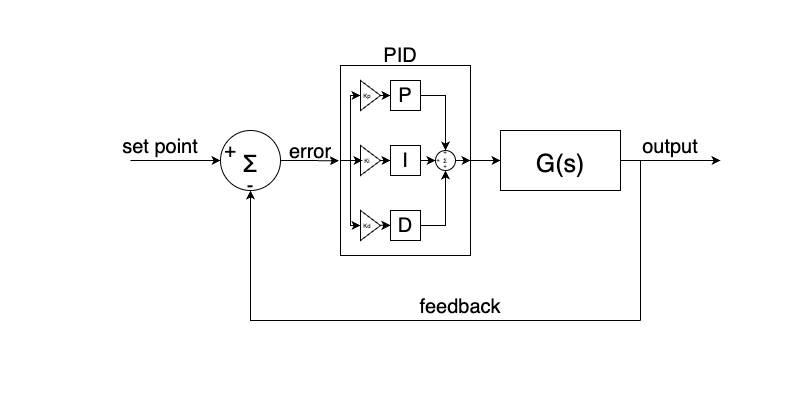

The main goal of the project is to act as a resource for teaching the basics of control theory and in particular the practical implementation of a PID controller. Below is a system diagram showing the main components of the system and their connection in the common system diagram format.

Before we dive into the details, there are two videos of mine which will help, this first one is dedicated to explaining the [software behind the system in general](https://www.youtube.com/watch?v=OBsXWNbOTRY) and the next one is an in depth look at [implementing your own PID controller from scratch on an Arduino](https://youtu.be/RZW1PsfgVEI) (you may want to wait until after you have read this to watch, or not, who knows!).

## What is a System?

In engineering there came a point where machines started to evolve from being purely mechanical. With the advent of electricity and electric motors, there became a need to use a common framework to control system containing both electrical and mechanical elements. However, before we could control such a system, we need a common way of modelling it. To this end, the idea of systems & control theory started to come about. There are lots of formal maths that surround this topic, however we are only going to lightly touch on that here.

Typically we can thing of a system as being anything either electrical or mechanical or both, that takes some input that we can model and produces some output that we can also model. Usually the model of a system would be some mathematical function where we write the output as a function of the input. With expressions for the input and output we can define something called the transfer function for the system. This is basically a single mathematical expression that defines the characteristic of the system we are working with. Again, not getting into the details but this function is labelled `G(s)` and is the Leplace transform of the input expression divided by the Leplace transform of the output expression. If you feel comfortable looking into the maths behind this, I suggest researching the topic on your own. I can highly recommend Modern Control System by Dorf & Bishop for this topic.

For this discussion I only want you to be aware that a highly complex system can be broken down into a single function that defines it's behaviours and in control engineer we would refer to it via it's transfer function. In terms of control theory, we often refer to the system being controlled as the "plant". We would also often present it in block diagram for like below.

The above just simply represents some input to the system, being fed into the system and providing an output. It should be noted that transfer functions can be simple or complex and they can be nested. However, no matter how complex, they can always be boiled down to a single block in a control diagram. It should also be noted that you don't necessarily need to derive the transfer function for a complex system to control it. It is possible to use maths to analytically come up with the best control scheme for a system, but there are other methods, this will become clear later.

&nbsp;

---

&nbsp;

## What is Control Theory?

Considering the above diagram, we have what we would call an open loop system. This means that the input and outputs are totally independent. We feed some input to the plant, it does something, we get and output, but the system doesn't "know" anything about the out or the state surrounding the plant. A good example of a system that behaves like this is our stepper motor. The stepper doesn't know anything about it's state, we just give it an input and it goes to it's output. Due to the engineering of stepper motors we can trust that for the most part this system can be controlled in open loop. Let's consider another real world example of where open loop control might fall down. Consider a cruise control system in a car, we are on a straight flat road travelling at 100km/h. We trigger the cruise control and the system now holds the throttle (the input) at it's current level. This results in the car continuing to travel at the same speed (the output) of 100km/h. Now, lets consider what will happen when we approach a hill in the road. At the point, gravity will act against the car requiring the car to accelerate to compensate for gravity pushing it back down the hill. However, remember, our input doesn't know anything about our output. So the car will begin to slow down and the throttle position won't change at all.

The above example is missing something, we call it feedback. What the cruise control system was missing was the information that the the car has slowed down below the target speed and based on how much it had slowed, it needed to know that it should increase it's throttle to maintain speed. In control theory we would call this type of system a closed loop control system, other terms used are a feedback control loop or simply feedback loop. In these loops we usually have a set point (the desired speed of the car), and output (actual speed of the car), some form of sensor to provide feedback (the cars speedometer) and an error signal (the difference between the desired and actual speed). It should be noted that in these closed loop systems, the input to the plant becomes the error signal from the summation block in the diagram below.

Now that we have some working model of how a feedback system works we are in a far better state that we were with the open loop case. However, we are still missing a key ingredient to make the system do what we want. We are assuming that by piping the output of the system back to the input and feeding the error back into the system that we will get the response we desire. This is a fairly large assumption and for the majority of cases this will not work. There are some system that just so happen to be naturally stable and will respond fine to this situation, but that is not the general rule. Most sufficiently complex electromechanical systems are not going to be independently stable. The last missing piece from our system is something called compensation. There are many different types of compensators but one of the most widely used ones, the PID controller, is where we will focus our attention in the next section. To add compensation to a system, we need to insert something between the error signal and the input of the system. What this will do is figure out what the best input should be to the plant to minimise the error signal as much as possible. With some clever maths, these compensators can drastically change the characteristics of a plant and are extremely powerful. So much so that the basics of these system has remained unchanged for 100 years (that's right you don't need computers for these, you can build fully analog compensators...wild!).

Before we move on, as a final note, have a look at the plot below. It is a common type of system response plot that you might see. This should help give some intuition as to how our system will respond when we are trying to get it to settle to some set point. We will start at some value, in this case 0, we will command the system to reach a value, in this case a little less than 1.5. As the system runs, it will begin below the set point with a large error value. This error value will be fed into the plant demanding a large response. The system will respond and end up overshooting the target by a decent margin. At this point the error will turn negative because we have overshot the target and now we need to bring it back down again, so we will change the input of the plant to compensate. This continues for a time until as we see we settle down to a steady state with little or no error. This type of second order system response is really common all over engineering and you will see it in some many different systems. Have you ever noticed in a home heating system how when you change the temperature it sometimes ends up going higher or lower than you wanted first before settling down to the value you wanted? That is because it is doing the exact same thing as I talked about above (and is probably use a PID controller to do it too!).

&nbsp;

---

&nbsp;

## How Does a PID Controller Work?

The first thing we should do is present a diagram of what a PID controller looks like that we can refer back to. The below is more or less the same as before, but we have have the PID block added. I have exposed it's internals to make it clear how the parts interact, but again, we would usually just leave it as a single block in a system diagram.

The above might look a bit confusing but we can break it down into little chunks and explain each part. Firstly, lets talk about the name of this type of controller P.I.D. This is an acronym for Proportional, Integral and Derivative. What the block diagram is showing is how these terms combine to produce the input to the plant. Each part of the PID controller receives the error signal. There are then gains applied to the signal for each part. I haven't spoken about gains before, but you can think of them as being just constant numbers you multipliy the error by in order to scale it. Overall, their effect is to determine how much of an effect on the overall result each part of the controller has. We use the letter `K` to denote a gain, so in our case the three gains are `Kp`, `Ki` and `Kd`. So imagine I want the proportional part of the controller to be weighted twice as much as the integral, I could set `Kp = 2` and `Ki = 1`. If For example I didn't wan't any derivative parts in the controller, I could set `Kd = 0` and that would remove it's influence completely. Moving on, the error signal is used by each part, scaled by the gain to produce some output for each part. These parts are then all added back together to produce the input for the plant. The way in which we actually control the system is by choosing values for `Kp`, `Ki` and `Kd`. Remember earlier when I said you can use maths to figure out how the controller should be set up to achieve your desired results? Well, this is what I meant, you can derive ideal values for these parameters and plug them in. However, this is not the only way to do it!

Up until now I haven't told you what each part of the PID controller is actually doing. If you build up some knowledge of what these parts do and how they interact, you can roughly tune a PID controller with no maths at all and just an intuition for how the system will respond. This is where this topic starts to feel more like art than science and for sure tuning PID controller is a skill that you need to develop over time. Outside of the hobby realm, even if you use tools to derive the equations and computers to spit out the ideal PID values, they will usually be based on approximations made by the model for the system which are usually simplified. They might get you 90% of the way there, but the rest is often down to trial and error and tuning the values by hand.

Let's start our discussion about the parts starting with the `P` term. This is the simplest term of the three. As the name would suggest, this term just provides a response that is proportionally based on the error signal. It does this simply by multiplying the error signal by the `Kp` gain. This effectively is just going to scale the error in some way either making it larger or smaller. Often times scaling the `P` gain alone is enough to make a system stable but often it is not. One intuition for this is that it can cause the system to respond faster or more aggressively the larger the gain is. This means that for a small error signal you could get a very large response which might be desirable in some cases, but in others it might throw off the stability massively.

The `I` term is where things will start to get a little more complex. `I` stands for integral in the mathematical sense of the word. We aren't going to go into detail here, but essentially integration seeks to find the area under a certain curve. In the abstract, if you have a signal the varies over time, the sum of that signal at each point over time is effectively the integral of it. So for the controller, the `I` keeps track of all of the past error values and continually adds them up with respect to the time that has passed. This might seem strange, but think about a system where something is oscillating back and forth around the set point. There is a constantly changing error signal moving plus and minus the whole time. The `I` term will sum these errors and it's effect will increase in the overall output which can help to reduce the steady state error.

Finally let's talk about the `D` term. Again, as before, `D` starts for the mathematical concept of a derivative. Without going into it too deeply, you can think of a derivative as the rate at which something is changing. So in our system, if a value changes suddenly, the `D` term can end up being very large in response to this. This can be useful if you need a system that responds quickly to sudden changes in state, but it can also cause high frequency noise and is very sensitive to instability. It can in fact be so difficult to tune that often it's gain is set to zero leaving only the `P` and `I` terms. This type of controller is called a `PI` controller. Where it is left in, it typically has a fairly small gain value to prevent it dominating the other two terms creating instability.

That's about it for the basics of control theory. I suggest that you go and watch the following two video if you haven't already. After reading, they may make a bit more sense if you ahd previously tried to watch them! Here they are again, the [software behind the system in general](https://www.youtube.com/watch?v=OBsXWNbOTRY) and an in depth look at [implementing your own PID controller from scratch on an Arduino](https://youtu.be/RZW1PsfgVEI).

If you have made it this far and have read everything in order, congratulations! You are now finished all of the supporting materials for this kit. I hope they have been helpful and I hope you feel ready to tackle the kit and have fun playing with it!
