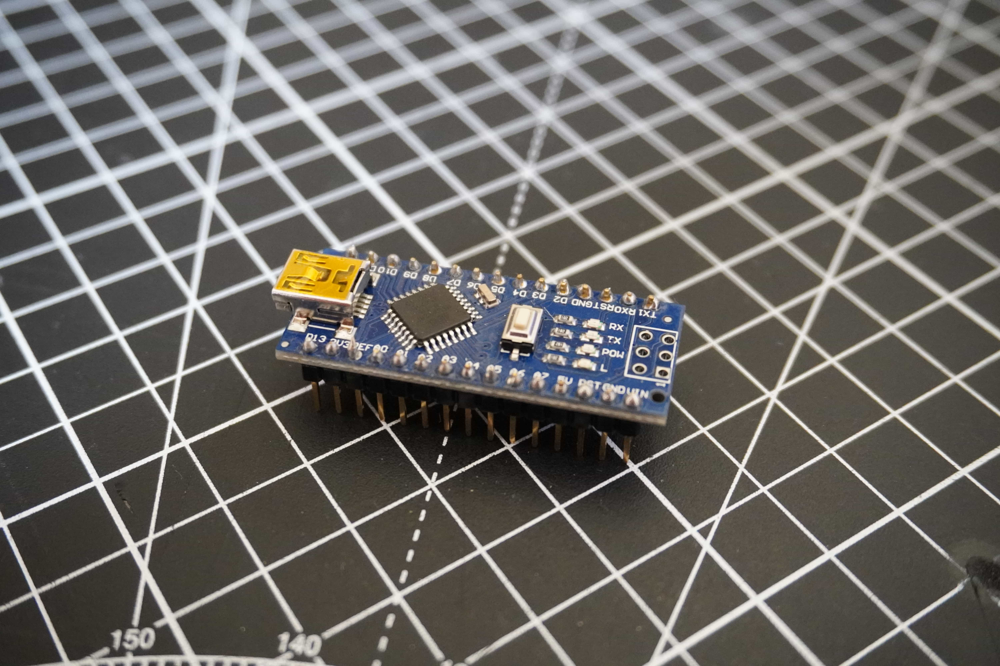
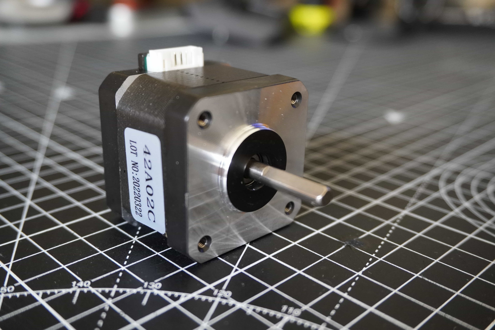
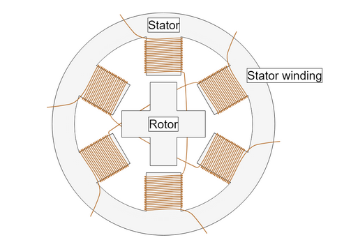
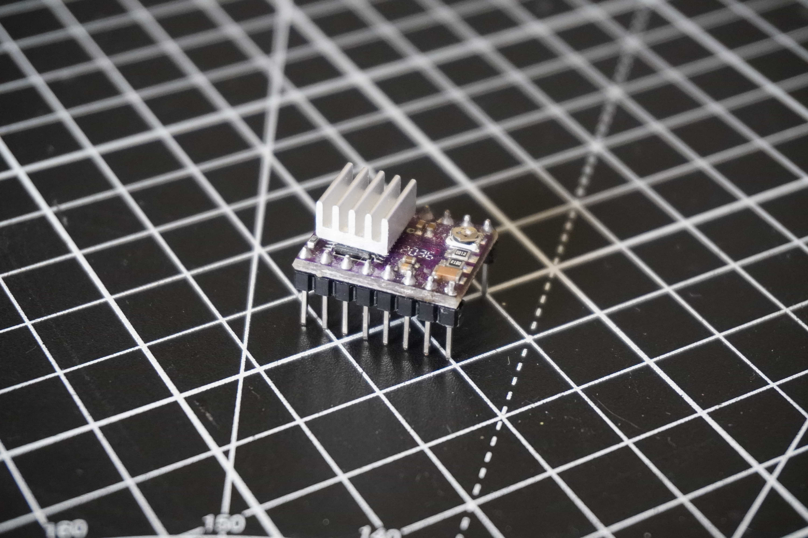
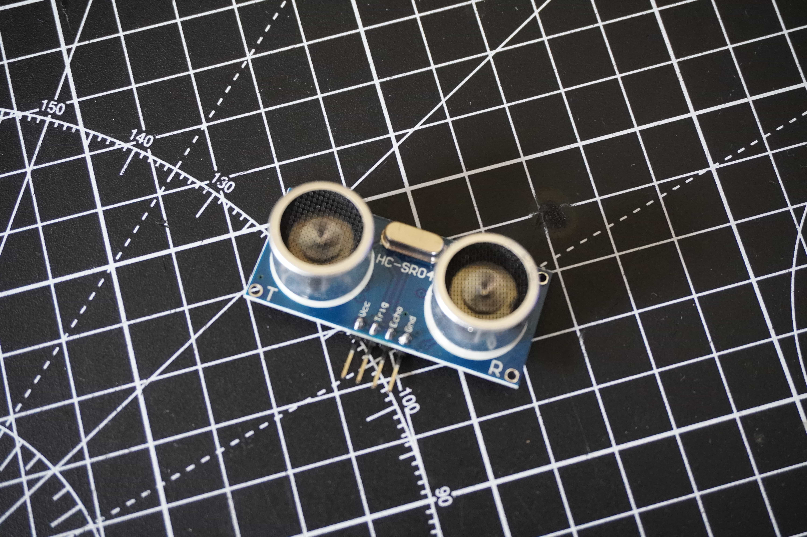
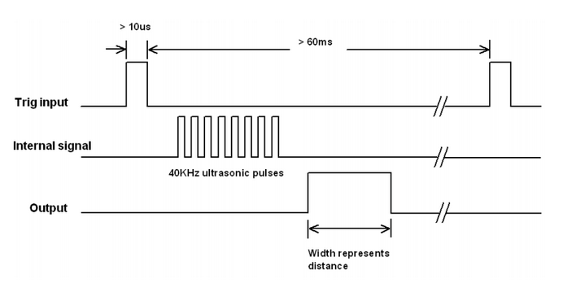
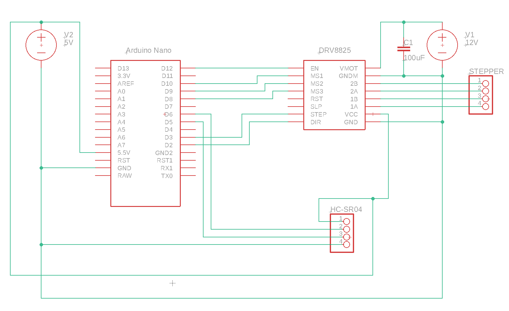
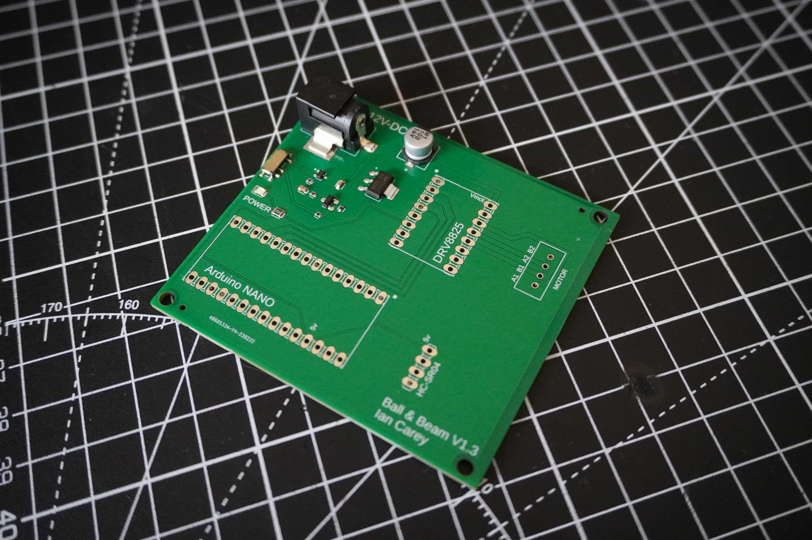
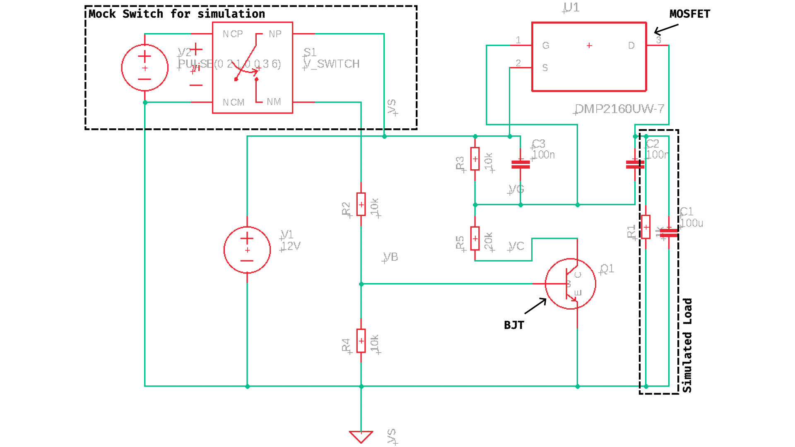

In this section we are going to break down our discussion into four main topics for discussion; stepper motors and drivers, the Arduino microcontroller, the ultrasonic position sensor and finally the PCB. Before we talk about the PCB I have also included a basic diagram of a breadboard version of the circuit and some tips on assembly etc. The most advanced topic of the discussion is the PCB and in this section we will also discuss the details of the design of the power switching circuit on the board. The final section is optional and fairly abstract, but if you want to dive into some analog electronics design, it's worth a read.

&nbsp;

---

&nbsp;

## Arduino

An Arduino is a low cost, flexible, simple and robust microcontroller development platform originally built around Atmel microcontrollers. In the wild, microcontrollers are the smart chips that control electronic devices. Microcontrollers are tiny programmable computers that exist on a single chip. In terms of electronics, they occupy the space somewhere between things that are simple on-off devices with analog components and fully fledged computers. That is to say, a microcontroller can typically interface with simple low level electronics but can bring some intelligence to them while not having the power of a full computer. Even tho these devices don't have the computing power of full computers, modern microcontroller are incredibly powerful and capable of doing amazing things. Microcontroller shine in their ability to do relatively complex tasks at a low level very fast while consuming very little power. Consider that a modern computer has to be able to do lots of different things all at once, typically a microcontroller only has to do one or a small hand full of things at a time; in this way, they can be highly optimised for the task at hand.

While there are loads of different kind of microcontroller available these days, Arduino's provide a great platform to learn embedded software development and electronics. It should be noted that "an Arduino" is a development board and accompanying software stack for developing embedded software projects and not specifically a microcontroller. The microcontroller is the little chip on the board that is the brains of the operation. However, Arduino's are usually referred to as microcontrollers, all be it slightly incorrectly. Arduino's are cheap and very robust, they are hard to blow up compared to other kinds of microcontroller, and when they are blown up, they are easily replaceable. Arduino's also come with a companion software development environment and a whole host of nice libraries and hardware abstractions which means you can get up and running really quickly. There is also a huge online community ready and willing to provide support.

For all of the above reasons and more, I choose to base the kit around an Arduino. I also have a lot of experience personally working with these devices so it was quick for me to prototype the system using one.

To learn more about Arduino I suggest visiting their [website](https://www.arduino.cc/) where you can find loads of information on them. Aside from the basic background presented here, we will dive into more detail about working with an Arduino in the [programming](../programming) section of this guide.

For this project, we will use an Arduino Nano. You can use any Arduino for this, but if you wish to use the PCB for the project, it has a socket which will accept an Arduino Nano. Also note, if you are sourcing an Arduino for the first time, you can buy them from the Arduino website, however these days you can buy many many clones of them online. They are all largely the same, some might have slight differences. Largely these are fine to use but buy them at your own risk as some can be faulty. With that said, they are usually available at a fraction of the price of the branded versions.

&nbsp;

---

&nbsp;

## Stepper Motors & Drivers

Stepper motors are a special kind of brushless DC motor that are capable of accurate positioning with no external sensors under normal operation. This means that you can command the motor to spin a certain amount of degrees and hold it's position. The motor will move to the commanded position and stay there with very little error. This effect is achieved pulsing coils in the motor in a certain pattern, the magnetic field created with these coils then interacts with a specially shaped toothed rotor in the motor snapping the motor between so called "steps".

In this way, each rotation of the motor is actually made up of lots of small "steps" hence the motors name. In effect stepper motors are sort of like a poorly designed DC motor in that each state the motor gets into it doesn't really want to leave. This also means that at each step the motor has a very powerful holding torque and doesn't want to slip. These traits can be leveraged in many applications to make stepper motors extremely useful.

In terms of machine control, you can work out how many steps correspond to a certain about of movement of an axis of a machine. Once this is known, you can tell the machine how far to move the axis byt sending the correct number of steps to the motor. Due to the way the motors moves in steps and doesn't want to slip from it's holding position, this is extremely accurate and does not require sensors to detect the actual position.

One common modern usage of stepper motors is in low cost desktop 3D printers. The prevalence of these devices has made the NEMA 17 form factor of stepper motor widely mass produced and easily purchased the world over for very low cost. However, they do come with certain disadvantages including extra complicity in their operation. Compared to a regular DC motor, stepper motors require a driver and controller to function. Typically you would use a stepper driver board to interface directly with the motor and a microcontroller to tell the driver when to step the motor. Thanks to the 3D printer market, stepper drivers are also widely available and cheap such as the DRV8825 and in general microcontrollers are also cheap these days, so the expense might not be huge but there is a step up in complicity with compared to flicking a switch for a DC motor.

Considering all of the pros above, a stepper is a decent choice for this project. However it may not be the best choice for all control type projects. The nature of this machine means that the motor doesn't need to move very fast. While moving fast is something stepper motors can do, there are limitations to how fast an Arduino can drive a stepper and so if you require very high speeds this might not be the best solution.

Without going into hugh detail, it's worth knowing that the maximum speed your stepper can attain with be related to how fast your driver can send pulses to the motor (along with how fast your motor can respond to the pulses). The driver in theory will send a pulse to the motor every time it receives a pulse from the microcontroller. Typically the driver will have a "step" pin, by pulsing it high and low from the microcontroller, it will then send a "step" pulse to the motor. There is a minimum pulse width required by the driver and also a theoretical max frequency of the pulses set by the clock speed of your microcontroller. For an Arduino using the widely used [AccelStepper library](https://www.airspayce.com/mikem/arduino/AccelStepper/) this more or less ends up maxing out the pulses per second to 4000 on an Arduino with a 16Mhz clock.

&nbsp;

---

&nbsp;

## Ultrasonic Position Sensors

In our system the "feedback" loop is created by the use of a HC-SR04 ultrasonic position sensor. This is a low cost high performance method of detecting objects by bouncing high frequency sound waves off them and measuring the time of flight of the pulses as they echo back to the module.

If you look at the modules you will see that there are two pieces that look like little speakers. In reality one if a speaker and one is a microphone. When the device is triggered, the speaker side emits pulses of sound which are then reflected back and picked up by the microphone side. The device generates output pulses which can then be measured by a microcontroller to determine the distance of the object reflecting the sound back to the sensor. Below is a graph of what the signals look like as they are transmitted.

These modules are fairly accurate however they have some limitations. Due to the nature of their signal, they work best when help perpendicular to a flat smooth surface. They also don't like turbulent air or high frequency vibrations in their vicinity. The only real limitation for our use case is that they also have a small deadzone as you get close to them, but this is handled by the design of the beam which has a built in buffer between the ball and the face of the sensor.

&nbsp;

---

&nbsp;

## Breadboard/Protoboard Circuit

The circuit above is fairly simple but there are a few nuances to take into account. Firstly, I would suggest powering the entire thing from a single power supply. I recommend a 12V 2A DC Walworth power supply. This will provide enough current for the motor and also can be stepped down using a voltage divider or a regulator to give 5V for the other electronic. Either this or you can use a USB cable to power the Arduino which will provide the 5V needed for the rest of the circuit. I like to use a single power supply so that I am sure I have the same ground everywhere.

There is a single 100uF capacitor connected to the motor supply line. This is simple an anti ripple capacitor. It is common for cheap power supplies to have some rippled in them, this helps to get rid of this which prevents noise from impacting the driver. This is an important component and it should not be left out.

&nbsp;

---

&nbsp;

## PCB

For this project I designed a PCB because it was something I hadn't done before and wanted to try it out. With the consideration that this might one day be part of a kit, it also made sense to do this. If you are building your own version of this, the PCB isn't necessary unless, like me, you want to go through the process of getting one manufactured. That said, the design process is the more valuable part of getting your own made.

I'm not really an expert in PCB design and it's not critical for the project, so I am not going to go into much detail here. However, if you want to get your own made, you can find all the GERBER files [here](https://github.com/careyi3/balance_beam_kit/tree/master/electronics/manufacture) along with the bill of materials which will be accepted by the manufacturer I used [JLCPCB](https://jlcpcb.com/).

The PCB is really simple, it's mostly just plumbing together parts to make them nice and neat on one board. The traces are mostly just to connect the Arduino to the DRV8825 and to provide a port to plug the motor and sensor into. The most interesting bit of electronics on the board is actually the power supply that I designed with some help. I will go into this in more detail in the next section. It is however a more complex topic and totally unnecessary for the project. Feel free to skip over the next section unless you are specifically interested.

&nbsp;

---

&nbsp;

### Power Circuit

When I decided to design the PCB for this system, I knew I was getting myself in for lots of things I didn't know and lots of things I had log forgotten from studying engineering years ago. One thing I knew is that the power switch wasn't going to be simple. This might seem strange, but switching can be a tricky thing to do, especially on a PCB with components of varying power consumption. In our case, we have a power switch which needs to cut off power to a microcontroller and a sensor module, no big deal, these devices draw very little current, any tiny pcb mounted slide switch could handle it. However, we also need to cut off power to the motor driver and driver board, this is where the tricky part is. If you think about a basic switch, it's normal closed state is a broken circuit where the supply is on one side and the load on the other, no current flows, all good. When the switch is flicked, suddenly the supply and the load are connected, depending on the load, this could end up drawing a lot of current. Now, in our case the max current we could expect is in or around 1.5A max, that's not a huge amount of current in general, but, when you think that all of it will be being pull through a tiny little switch, you can probably guess the issues that might arise. In fact, if you look at the specs for most of the tiny slide switches on the market, they are all only rated for tiny current. Pulling anything close to 1A through them would surely burn them out immediately.

With all of this in mind, we need to come up with a solution to be able to switch a relatively heavy load on and off, with out the switch itself physically carry any of the load current. There are many ways to do this including the age old and simple mechanical relay. However, a more modern solution to the problem would be to use a switching circuit made up of transistors. Transistors are effectively electronic switches which can be turn on or off by changing certain conditions around them. Typically the physical components have three pins and by wiring them in a certain way, you can make them only conduct across their input and output when a certain voltage is provided to another one of their pins. Now, that is a very basic explantation, their are different flavours of these transistors and the ways in which they work is more complex than I described above, but that's the basics of what you should know about them. In our switching circuit we use two transistors to make our switch work. The full circuit diagram I used to design and simulate this is below. We won't worry about all of the circuit as some of it is just set up to simulate things, but I have highlighted the important parts.

In our circuit we are using two transistors which have slightly different characteristics. I won't get into the details of their differences but the two types are a Bi-Polar Junction Transistor (BJT) and a Metal-Oxide-Semiconductor Field-Effect Transistor (MOSFET). In terms of naming, I will just say that the pins on a BJT are named the collector, base and emitter. While on a MOSFET they are called the source, gate and drain. You can sort of think of the base and gate pins as being the on/off pins with the other two being the input and output. These components are highlighted in the above diagram. Also highlighted above are the two parts which are just for the simulation. These include an imaginary RC load and a switching circuit which allows for the "switch" to be flicked on and off in the simulation to see the different states over time. In your head, you can replace this with a normal switch being turned on and off by hand. Let get into how the circuit works.

In the initial state, the switch is turned off. With the switch off, the base of the BJT is pulled to ground via the resistor R4, this in effect turns off the BJT and no current flows between the collector and emitter. If we now look at the MOSFET, we see that it's gate pin is connected to a voltage divider in line with the collector of the BJT. With the BJT turned off, the lower branch of the voltage divider is ignored and with no current actually flowing through the gate of the MOSFET (that's just how they work), the voltage at the gate is effectively 12V i.e. it matches the supply voltage. You will notice that the source pin is also connected to the same 12V and so their is no voltage different between them. This is important, because the MOSFET will only turn on when the voltage difference between the source and gate exceeds a certain amount. Now, lets talk about the case when the switch is turned on. With the switch turned on, the BJT now has it's base connected to some proportion of the supply voltage. In this specific set up the BJT will enter "saturation" and will conduct between the collector and the emitter. Now if we go back to the voltage divider connected to our gate, the end of the divider at R5 is now effectively connected to ground meaning that the voltage divider now acts as normal and the voltage at the gate of the MOSFET will be 8V thanks to the 1:2 ration of the resistors R3:R5. We now have a case where our gate is at 8V and our source is at 12V. Now, the threshold of voltage difference has been exceeded and the MOSFET will turn on and conduct between source and drain. In our case, the output of the drain powers everything on our board.

The above is dense and I have glossed over many parts but I hope it makes some sense as to how we can switch a high load circuit without the switch it's self actually carrying any of the current. The only component in this circuit that really carries any current is the MOSFET. It just so happens that MOSFETS are designed very well for this task. The relatively high resistor values in the rest of the circuit are specifically to limit current flow in the switching circuit. The BJT is also not dealing with any high current either. As a final note, I haven't spoken about the two capacitors on the source and drain of the MOSFET. These are called charging capacitors and help lower the current spikes when the switch is turned on. If you have a load with lots of capacitors on it, when you turn on the power, all of the capacitors will effectively charge up all at once. This can cause a massive spike is current draw on switching and can lead to components blowing as they aren't rated to handle this. These charging capacitors help to smooth out the sudden current draw caused when switching a capacitive load.
