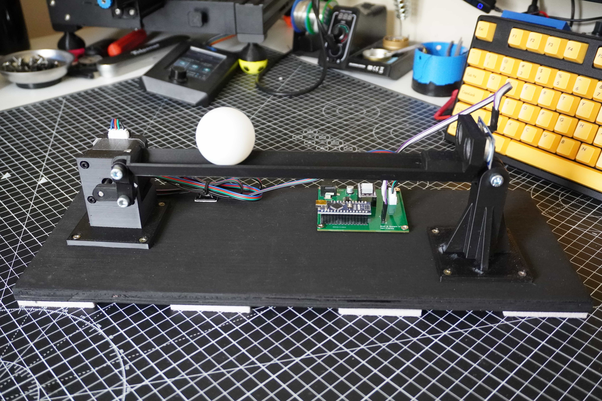
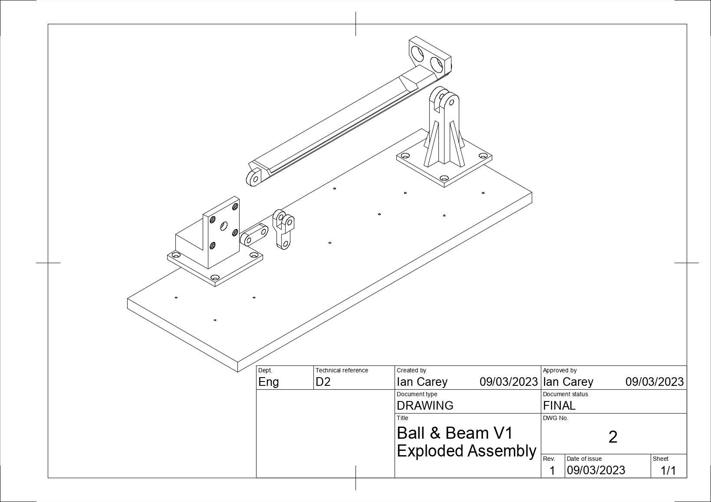

---
# Feel free to add content and custom Front Matter to this file.
# To modify the layout, see https://jekyllrb.com/docs/themes/#overriding-theme-defaults

title: Welcome!
layout: home
---

This is main project site for the Ball & Beam kit by Ian Carey. This guide covers everything you need to know to get up and running with the Ball & Beam kit from assembly, to programming to the theory behind how it works! The below sections are laid out so that they build on each other but you should jump in and out of them in what ever order makes the most sense to you.

All of the source materials, code, 3D printing files can be found here on the projects [Github repo](https://github.com/careyi3/balance_beam_kit). Enjoy!

The development of this kit has been fully documented on the creators YouTube channel, if you are interested, you can find the entire build series [here](https://www.youtube.com/playlist?list=PLMqshdJjWZdnB4wa5L2HWYxcJ6pagYxFq).

&nbsp;

---

&nbsp;

## Bill of Materials (BOM)

This is a list of all the materials you will need for this project. This project is currently still a fully DIY kit where we are only supplying the guide but you must supply all the parts. In future we hope to release purchasable kits that will contain the parts. For now, this is the best we can do.

[BOM](./bom)

&nbsp;

---

&nbsp;

## Assembly

Instructions, with photos, of the mechanical assembly of the rig. The assembly is straight forward enough involving only 5 3D printed parts all of which should easily be printable on most common 3D printers. For reference, all of the parts for this were designed to be printed on an Ender 3 V2.

[Assembly](./assembly)

&nbsp;

---

&nbsp;

## Electronics

Details all of the the electronics involved, Arduino, stepper motors, position sensors and details of the PCB design.

[Electronics](./electronics)

&nbsp;

---

&nbsp;

## Programming

Details of the code involved in the system and working with the Arduino platform. We will also dig into the various libraries used in the project and how they work.

[Programming](./programming)

&nbsp;

---

&nbsp;

## Control Theory

Background theory on control theory and supporting materials.

[Control Theory](./control_theory)
