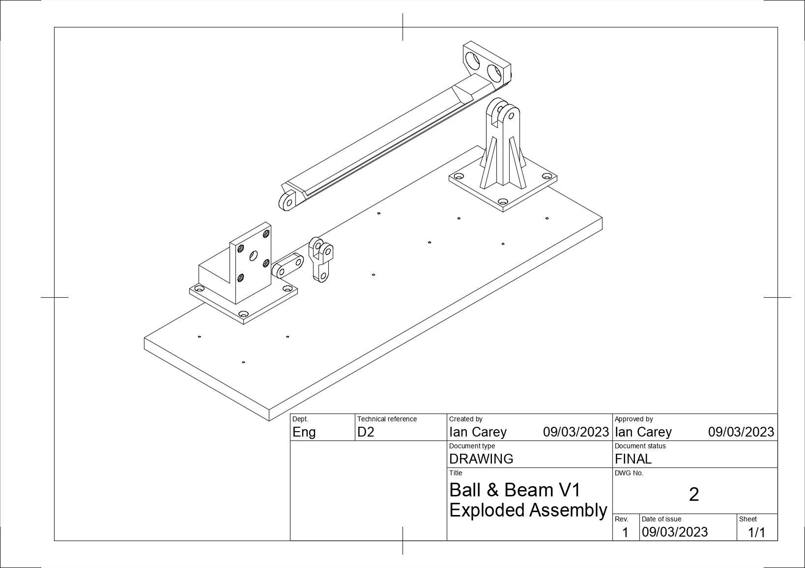
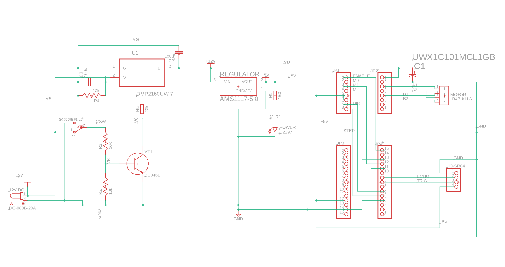

---
# Feel free to add content and custom Front Matter to this file.
# To modify the layout, see https://jekyllrb.com/docs/themes/#overriding-theme-defaults

title: Welcome!
layout: home
---

This is main project site for the Ball & Beam kit by Ian Carey. You can dive right in by following the [Getting Started](./getting_started) guide.

If you want to read more about the specifics of some of the topics covered in the guide, you can find the links below.

### Assembly

Detailed instructions on the mechanical assembly of the rig.

[Assembly](./assembly)

### Electronics

Details all of the the electronics involved, Arduino, stepper motors, position sensors and details of the PCB design.

[Electronics](./electronics)

### Programming

Details of the code involved in the system and working with the Arduino platform.

[Programming](./programming)

### Control Theory

Background theory on control theory and supporting materials.

[Control Theory](./control_theory)
